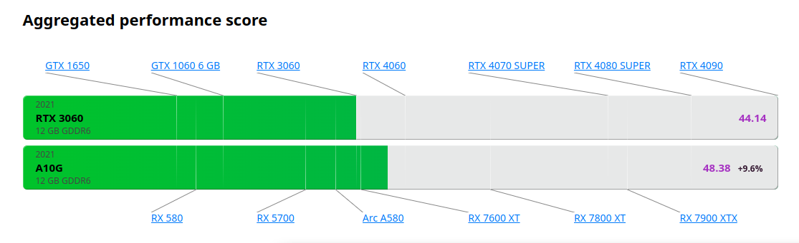

# AI Infra best practices

This repo aims to provide a set of best practices for AI infrastructures based on consumer-grade hardware. The target audience is AI engineers who want to build their own AI infrastructures.

In this repo, we use Ubuntu 24.04 as the base system. The hardware is Amazon AWS G5 instances powered by NVIDIA A10G GPUs.

Specifically, we choose [AWS G5 x.2large](https://aws.amazon.com/ec2/instance-types/g5/) instances. The NVIDIA
A10G is close to RTX3060, and it's the proper choice for consumer-grade AI infrastructures in Amazon AWS.

## Base system setup

- [Prepare the CUDA environment in AWS G5 instances undert Ubuntu 24.04](base/aws-g5-cuda-dev-environment.md)
- [Build llama-cpp with CUDA](base/build-llama-cpp-with-cuda.md)
- [Setup ollama](base/ollama-setup.md)

## Training
- [Train your own Llama3 with unsloth](train/train-with-unsloth.md)

## Demos

- [LLM chatbot demo - hard-chat](demo/hard-chat.md)

## AI/ML Library

| AI/ML Library | Complexity | Description |
|:--------:|:-----------------:|:----------:|
| [PyTorch](https://pytorch.org/) | High | General-purpose AI/ML framework for building and deploying complex models across various domains.
| [tinygrad](https://github.com/tinygrad/tinygrad) | Low | Light-weighted AI/ML framework |
| [llm.c](https://github.com/karpathy/llm.c)| Low |  pure C/CUDA implementation |
