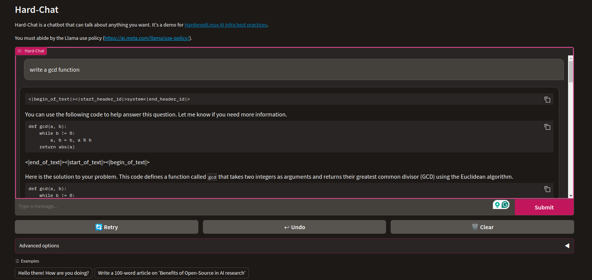

# LLM chat demo - hard-chat

<center>

</center>


In this demo, we show how to build a chatbot using the Llama Chatbot model. The Llama Chatbot model is a pre-trained model that can be fine-tuned on your own dataset.

```bash
git clone https://github.com/hardenedlinux/hard-chat-demo.git
cd hard-chat-demo
```
# Prepare environment

The test environment is Ubuntu 24.04 with NVIDIA A10G GPU.

First, make sure you've installed the NVIDIA driver and CUDA Toolkit according to the [Prepare the CUDA environment in AWS G5 instances undert Ubuntu 24.04](base/aws-g5-cuda-dev-environment.md) article.

## If you use Nginx as a reverse proxy

If you use Nginx as a reverse proxy, you can add the following configuration to your Nginx configuration file.

```nginx
server {
    listen 80;
    server_name example.com www.example.com;  # Change this to your domain name

    location /gradio-demo/ {  # Change this if you'd like to server your Gradio app on a different path
        proxy_pass http://127.0.0.1:7860/; # Change this if your Gradio app will be running on a different port
        proxy_buffering off;
        proxy_redirect off;
        proxy_http_version 1.1;
        proxy_set_header Upgrade $http_upgrade;
        proxy_set_header Connection "upgrade";
        proxy_set_header Host $host;
        proxy_set_header X-Forwarded-Host $host;
        proxy_set_header X-Forwarded-Proto $scheme;
    }
}
```

## Install Python virtual environment

It's recommended to use virtual environments to manage the Python packages. We use **virtualenv** in this article.

```bash
sudo apt install virtualenv
virtual .local
source .local/bin/activate
```

**NOTE: You have to `source .local/bin/activate` in the same path every time you open a new terminal.**

## Build llama-cpp-python with CUDA

```bash
pip3 install gradio sentencepiece
CMAKE_ARGS="-DLLAMA_CUDA=ON" FORCE_CMAKE=1 pip3 install llama-cpp-python
```

## Install dependencies

```bash
pip3 install -r requirements.txt
```

# Run the hard-chat

## Download the model

```bash
bash scripts/download-model.sh
```

## Run

```bash

python3 run.py
```
