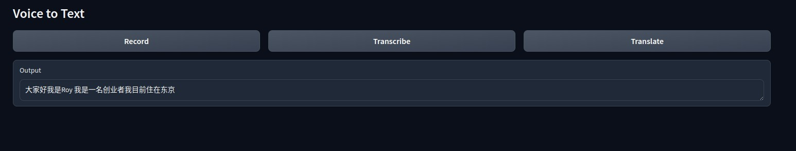
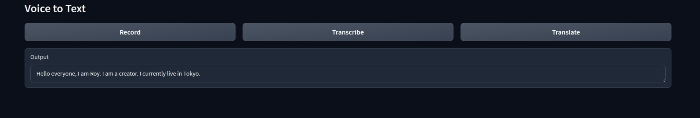

# Voice to text and translation

This demo is a simple voice to text and translation application. It uses [Whisper model](https://github.com/openai/whisper) to transcribe the voice and then translate the text to the target language.

<center>

</center>

**This demo can run on an older GPU like NVIDIA GeForce GTX 960. But we still introduce it in AWS-G5 as a standard baseline. You may choose as you like.**

## Environment setup

### Install CUDA

First, make sure you've installed the NVIDIA driver and CUDA Toolkit according to the [Prepare the CUDA environment in AWS G5 instances undert Ubuntu 24.04](https://github.com/hardenedlinux/ai-infra/blob/master/base/aws-g5-cuda-dev-environment.md) article.

### Prepare the environment

```bash
sudo apt install portaudio19-dev virtualenv

git clone https://github.com/hardenedlinux/hard-voice.git

cd hard-voice
virtualenv .local
source .local/bin/activate

pip install -r requirements.txt
```

## Configure

You can configure by modifying these lines:

### Select model size

```python
# Select from the following models: "tiny", "base", "small", "medium", "large"
model = whisper.load_model("small")
```

In our test, `small` is good enough.

### Select target transcription language

No, you don't need to specify transcription language. Whisper model will detect it automatically. Say, Whisper model know what language you are speaking. Amazing, huh?

### Select target translation language

```python
    options = {"fp16": False, "language": None, "task": "translate"}
```
If you set it to `None`, the Whisper model will detect it as English in default.

## Run the demo

```bash
python run.py
```

### How to use

First, click `record` button and say something. You can say various languages, say Chinese, Japanese...etc, and whisper model will detect and translate it automatically.

Then, click transcript button to get the the text you've just said.

<center>

</center>

Finally, click `translate` button to get the translation.


<center>

</center>
